##What does goHOME do?
The tl;dr for goHOME is that it enables you to monitor and control many pieces of home automation hardware through once common user interface. It also allows you to extend the functionality of various pieces of hardware with new features not supported by the original hardware manufacturers, such as scheduling, interop between different pieces of hardware (when my lutron lights turn on, set my Philips hue lights to 50%).

##Installing goHOME
Since goHOME is controlling devices in your home, you need to have the app running 24/7.  You can install the app on any computer architecture that is supported by the go programming language: https://golang.org/dl/

IMPORTANT: goHOME requires go 1.7 or above, if you have an older version you will need to update to 1.7 or newer.

###Raspberry PI
Raspberry PI is a cheap PC (around $25) that is popular for home automation, if you want to install goHOME on a Raspberry PI [here](raspberrypi_manual.md) are some detailed instructions.

###Other systems
If you want to install goHOME on other systems, Mac, PC etc. then you will need to manually build the goHOME project, currently binaries are not pre-built.  

####Building the executables
  - Install git (source control): https://git-scm.com/
  - Install golang https://golang.org/dl/
  - Setup your GOPATH https://golang.org/doc/code.html#GOPATH
  
Run the following commands:
```bash
go get github.com/markdaws/gohome
```
You may see some output like the following, you can ignore it:
```bash
package github.com/markdaws/gohome: no buildable Go source files in /home/gohome/go/src/github.com/markdaws/gohome
```

Change to the source directory which will be $GOPATH/src/github.com/markdaws/gohome and build the goHOME executables, running:
```bash
./build.sh
```
Once the build has completed, you will see two binaries in the $GOPATH/bin directory:
  - ghadmin: An admin tool for creating a new project and adding new users
  - ghserver: The goHOME server executable
  
####Creating your project
goHOME needs tow main files, a config file that specifies settings, like which IP address and port to use for the web server and a system file that contains all of your pject information, such as which hardware you have imported, user information etc. The first thing we have to do is init these files, choose a directory somewhere that you want to store these files, then run the following command (the argument specifies the directory where the goHOME source code is located):
```bash
ghadmin --init $GOPATH/src/github.com/markdaws/gohome
```
After the command runs, in the current directory you will see a config.json and gohome.json file, take a look inside. If there are any settings you want to change in config.json you can make them now.

####Adding a user account
You need to add a user to be able to log into the app, for example we will add a user "bob" with password "foobar", you have to specify the location of the config.json file that was created in the previous step:

```bash
ghadmin --config=/path/to/my/config.json --set-password bob foobar
```

####Starting the server
The server is responsible for communicating with all of your home automation hardware and serving the web UI. To start the server:
```bash
ghserver --config=/path/to/my/config.json
```
In the output you will see a line like (note the IP address is probably different):
```
WWW Server starting, listening on 192.168.0.10:8000
```
You can now load your browser and log in the to goHOME app!

##Adding hardware to your system
To see a list of the currently supported hardware, go [here](supported_hardware.md) If you want some other piece of hardware to be supported you can create an issue, but note that to add it we need real hardware to test so you can either try to add it to the goHOME source code yourself, or donate some hardware to the project :) I do buy as many devices as I can out of my personal money but there is a limit.

###IMPORTANT - before you begin
Before trying to add your hardware to goHOME you will need to set it up, such as connecting it to your router, giving it an IP address etc, you need to do this via the app supplied by the manufacturer, once you have set it up then you can add it to goHOME.  goHOME doesn't support configuring the initial state of the device, most of the time that ability is hidden by the manufacturers and not exposed to 3rd parties.

To add new hardware, go to the hardware tab

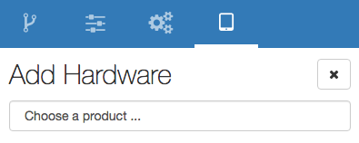

Choose the product you want to add, in this example we will add a Belkin WeMo Maker device. IMPORTANT: Make sure if there are any instructions shown in the UI you follow them, different hardware may require extra information, or for you to do something like hit a physical "scan" button on the hardware device before you try to import it.

Here we see that we found one WeMo device, and two features, a sensor and switch connected to the device. If you don't want to import a feature, you can uncheck the tick (maybe you don't use some of the features of a device). When you are ready hit the "Import" button, if there are any errors you will see items change to red, click on them for more info. If all goes well everything goes green

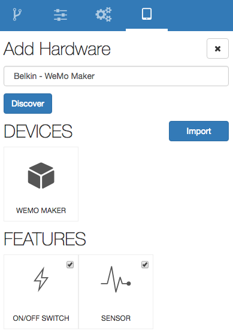

Now the device is imported, close the edit mode by clicking on the "X" in the top right and swap back to the feature tab, you should see the features with their current state

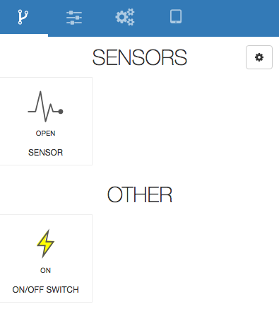

##Features
A feature is a piece of functionality that a hardware device supports. Currently supported feature types are:

  - Lights
  - Outlets
  - Switches
  - Heat (furnace control)
  - Window Treatments (shades, curtains)
  - Sensors

A device may have one or more features, for example the Belkin WeMo Maker device has a switch that you can turn on/off and also a sensor that has a open/closed state. So if we imported that piece of hardware we would see two features listed in the UI.  Below is an example screen showing the features tab with various features

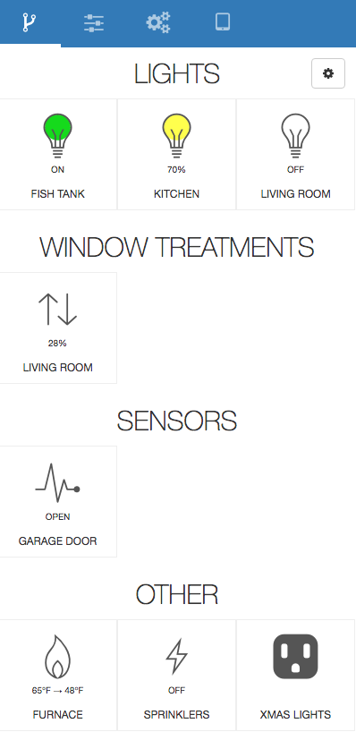

Once you have setup your system and have some features, simply click on the feature in the UI to expose the control panel, from here you can control your system. For example, below we click on the kitchen lights feature and set the intensity of the lights to 72%

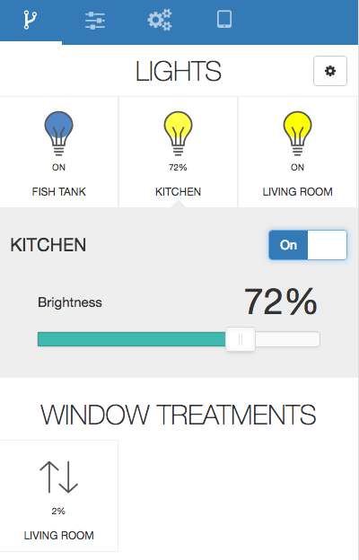

##Backing up your system
Once you have imported devices and configured your system, you will want to make a copy of the system config file. It is good practise to make a backup before you add new hardware incase something goes wrong or you make changes you are unhappy with. 

By default goHOME stores your system configuration in a file called gohome.json in the same directory where the gohome executable is located. If you want to change the location of the system file you can modify the [config](docs/config.md) file.

To see the contents of your config and system file and be able to quickly copy the contents to back up, log in and then look at the following URLs:

WARNING: goHOME currently only supports http, not https, so if you have exposed your goHOME server to the outside world, make sure you connect via some secure method such as a VPN, especially if you access the URLs below, because these files may contain login credentials for 3rd party services that will then be exposed to others if you access then via http.

http://[YOUR_IP_ADDRES]/config

http://[YOUR_IP_ADDRESS]/system

##Adding Scenes
A scene is simply a group of actions that should be executed when the user activates the scene, for example, a movie scene might execute the following commands:
  - Turn off all lights in the living room
  - Close shades in the living room
  - Set lights over the TV to 5% brightness

To add a new scene, click on the Scenes tab, by default it enters edit mode when you don't have any scenes, click on the "+" button on the top left to start adding a scene

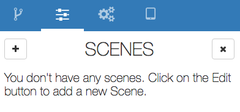

You will see a new scene form, enter the name, this is required, the address field is optional. IF you are importing scenes from 3rd party hardware sometimes they require an address, for now leave it blank and hit the save button

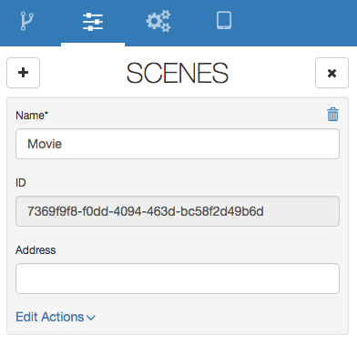

Now we can define the actions, a scene can have as many actions as you want, click on the "actions" link and select the type of feature you want to control e.g. Light, outlet, window treatment

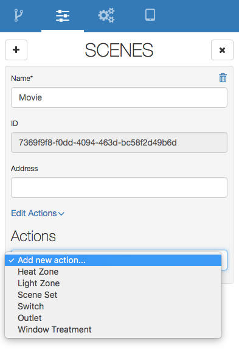

Next you choose the device and feature you want to control, in this example we choose the living room shade and set it to a closed state, then hit the save button to save the command

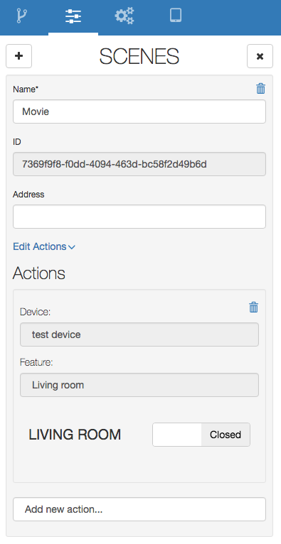

Next, click on the "Add new action..." option and we choose the kitchen lights and set them to 10% so we can still grab some food during a movie

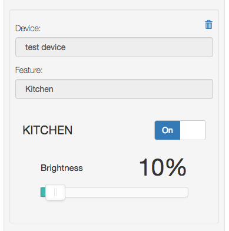

That's it, now you can exit the edit scene mode by scrolling back to the top and hitting the "X" button in the top right. You will now see a list containing the scene you just created, click on it to expand the scene information, you can then hit the "Activate" button to run the scene.

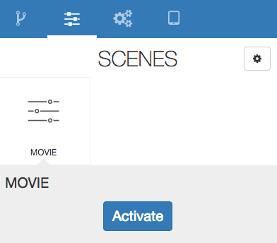

##Creating automation
Automation allows you to define actions that should run under certain conditions, for example, at sunset close all my window shades, or if I triple tap a certain light switch turn off all the lights in my house, or every day at 4pm turn on my garden sprinklers.

To get started creating some automation, follow the steps in [this](docs/automation.md) document.

##TODO:
  - Connecting to goHOME remotely
  - Upgrading gohome
  - FAQ delete
  - Device stops working (belkin), changes address, port
